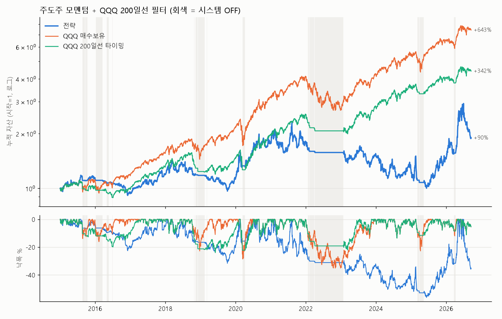

# 주도주 모멘텀 + QQQ 200일선 필터 (사전등록, 누적 N=100) — REJECT, 폐기 (2026-09-17)

기간 2015-01-02 ~ 2026-09-16 (11.7년) · 슬리피지 0.05% + 수수료 0.10% (편도) · 하루 평균 $50B 이상 대상 40.8종목 → 주도주 5종목 안팎 · 시스템 ON 83%

## 성과

```
                   누적%  CAGR%  변동성%  Sharpe   MDD%  Alpha CAGR차%p  Jensen α%/년    β   매매 수   승률%  평균 이익%  평균 손실%  평균 손익비  Profit Factor  평균 보유일
전략               89.60   5.63 25.19    0.34 -56.22         -13.10        -1.37 0.51 574.00 33.28    9.18   -3.65    2.52           1.25   10.94
QQQ 매수보유        643.02  18.74 21.90    0.89 -35.12           0.00         0.00 1.00    NaN   NaN     NaN     NaN     NaN            NaN     NaN
QQQ 200일선 타이밍   341.61  13.56 16.32    0.86 -24.03          -5.17         3.21 0.55    NaN   NaN     NaN     NaN     NaN            NaN     NaN
전략 (슬리피지 0.25%)   2.30   0.19 25.30    0.13 -62.82         -18.54        -6.68 0.52 575.00 30.26    9.66   -3.82    2.53           1.10   10.91
```

## 사전등록 판정: **REJECT**

```
① ΔSharpe CI 하한 > 0: False
② 두 반기 Sharpe > QQQ: False
③ 스트레스 Sharpe > QQQ: False
④ DSR ≥ 0.95: False
ΔSharpe -0.550 (95% CI -1.124 ~ -0.028) · DSR 0.000
```

## 반기 Sharpe

```
               2015~2020  2021~2026
전략                  0.60       0.19
QQQ 매수보유            1.02       0.77
QQQ 200일선 타이밍       0.78       0.95
```

## 청산 사유별

```
                      count   mean
why                               
20일선 하향 이탈              431   2.45
QQQ ≤ 200일선 — 전량 현금화     44  -0.47
손절 (시가 갭)                15 -10.45
손절 (장중)                  84  -6.23
```

## 연도별 수익률 %

```
         전략  QQQ 매수보유  QQQ 200일선 타이밍
Date                                
2015  13.06      9.44           1.06
2016 -17.32      7.10          -2.51
2017  27.11     32.66          32.66
2018  -0.78     -0.13          -5.26
2019  -4.00     38.96          17.87
2020  57.93     48.41          35.87
2021  -0.44     27.42          27.42
2022 -11.48    -32.58         -18.01
2023  -1.48     54.86          36.46
2024 -20.22     25.58          25.58
2025  17.20     20.77          13.11
2026  30.67     14.99           9.96
```

불변식: prefix 괴리 0.0e+00 · 매매 없음 = 현금 · 현금 ≥ 0 · 보유 ≤ 3 — 통과


